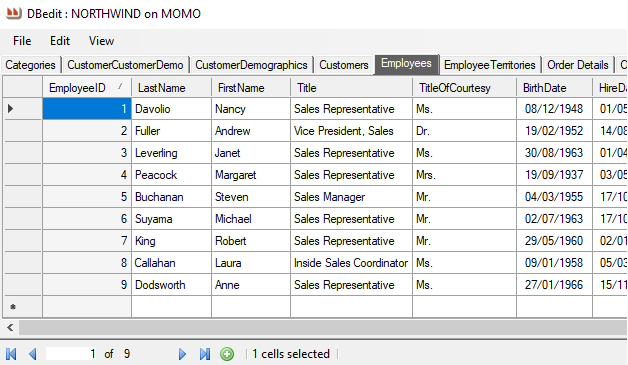
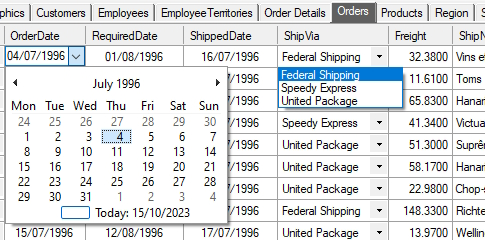
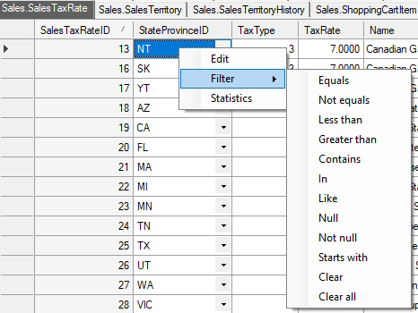
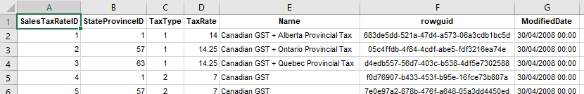
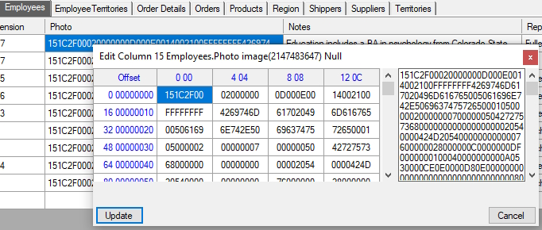
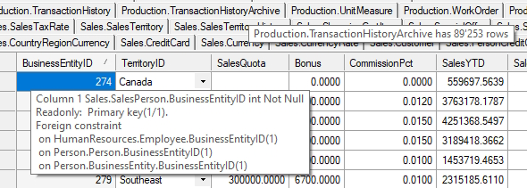
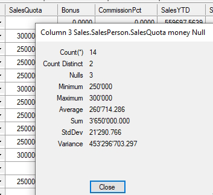
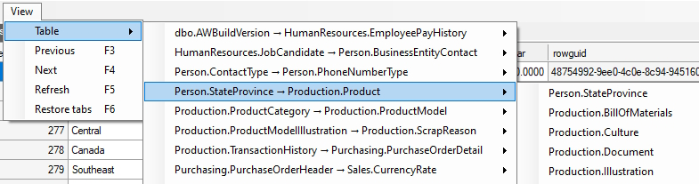
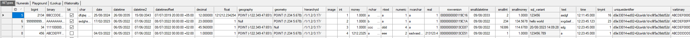

# DBEdit

DBEdit is a data editor for Microsoft SQL Server databases

## Features

*   Automatic dropdown lookups for foreign keys, dates  
    
    
    
*   Sorting and multi-column filtering  
    
    
    
*   Export to Text, HTML and Excel, with formatting
    
    
    
*   Editing in-cell or with a hexadecimal editor for binary fields
    
    
    
*   Meta-information in context-sensitive tooltips
    
    
    
*   Column statistics
    
    
    
*   Collapsable tabs with individual table selector
    
    
    
*   Supports all 33 data types and the extensions: User-Defined, Geography, Geometry and Hierarchy.
    
    
    
*   Fast, even for million-row tables

## Getting Started

### Dependencies

Visual Studio 2022

### Installing

Either:
* Download the release and run DBEdit.exe

or

* Download the repository, open DBEdit.sln with Visual Studio, compile and run.
Switch to Debug build to enable tracing to the debug window.

## Help

Everything in the UI has tooltips. Hover to see the context-sensitive help.

Right-click on tabs, cells, row and column headers to access commands.

## Authors

Maurice Calvert

## Version History

* 1.0.0
    * Initial Release

## License

This project is licensed under the GNU V3 License - see the LICENSE.md file for details

